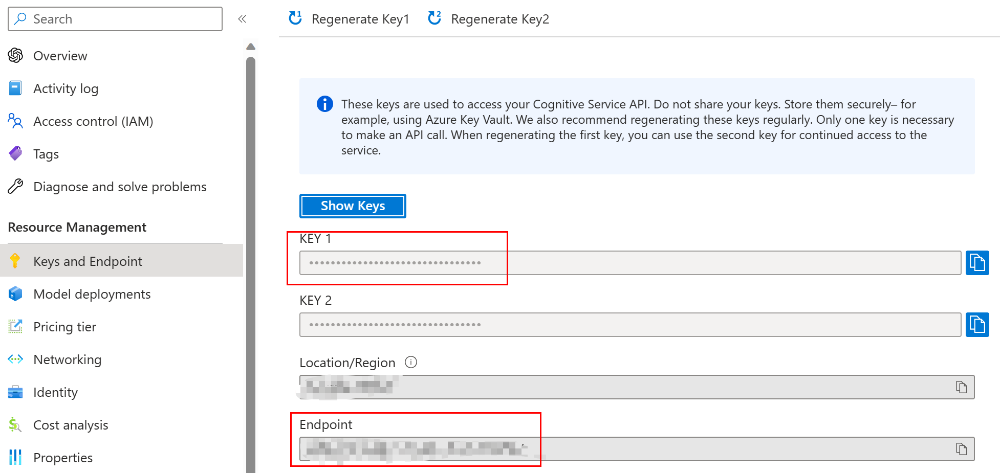

# openai-node-wechat
This repository contains code for a Node.js application that uses the OpenAI API to enable real-time chatting with a WeChat official account. With this code, you can build your own chatbot for your WeChat official account using the OpenAI API.

### Features

1. WeChat official account chat robot
2. Provide support for the last 6 historical messages using memory cache
3. Support Wechat voice message using Wechat Recognition
4. Extend Wechat timeout configuation to 13s
5. Return hyper link when backend service timeout  

# Prerequisite 
Before you begin, check whether the Node.js environment exists, and then check whether pnpm is installed.

1. You can use the `which` command in the terminal to check if pnpm is already installed. This can eliminate the step of installing pnpm:

- Check if Node.js environment exists:

  ```bash
  node -v
  ```

- Check if pnpm is installed:

  ```bash
  which pnpm
  ```

  If pnpm is already installed, the path information of pnpm will be output. Otherwise, nothing will be output.

  If pnpm is not installed, you can use the following command to install it:

  ```bash
  npm install -g pnpm
  ```

  After installation, use the `which pnpm` command again to check if pnpm has been successfully installed.

# Run Locally

- Update local environment configuation:

  ```bash
  cp .env.example .env
  ```

- Update OPENAI_API_KEY and OPENAI_API_BASE_URL with your Azure OpenAI configuration in .env



- Update WECHAT_TOKEN in .env

- Install dependencies:

  ```bash
  pnpm install
  ```

- run locally in watch mode

  ```bash
  pnpm dev
  ```